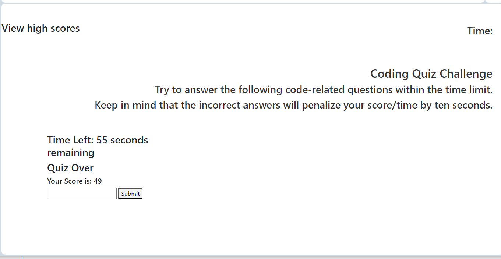

# ajscodingquiz
a coding quiz that keeps track of high scores

This is a timed quiz on Javascript fundamentals that stores high scores so that I can gauge my progress compared to my peers.

When I click on the start button the timer starts and I am presented with 5 questions.  If I answer a question incorrectly, time is subtracted from the clock. When all questions are answered or the timer reaches 0, the game is over.  I can save my initials and score. 

I learned how to use a timer and how to change from one section of questions to bring up another set of questions.  

I think what makes this project stand out is actually how I can answer one set of questions and the screen pulls up another set of questions.

I collaborated with 3 different tudors to get this code to work along with some fellow students.  I will still need to go back and do a little more before I can get the final work to do and look like what the homework demo is doing.

